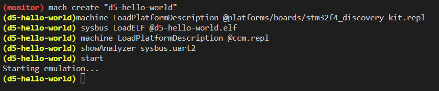
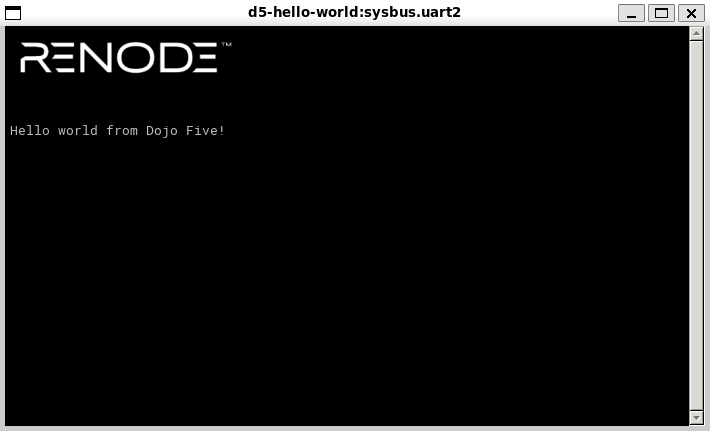
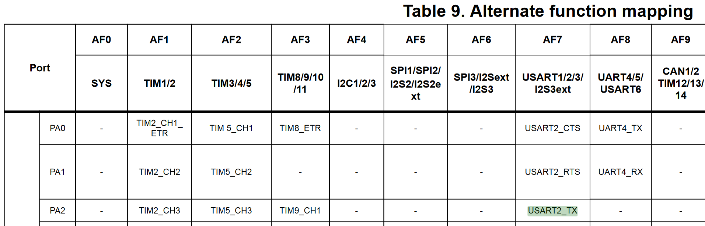

# Cloning with Submodules and Building for the First Time
 1. ```git clone --recurse-submodules https://github.com/StephenBerkner/Renode-STM32-Hello-World.git```
    * If you skipped the ```--recurse-submodules``` it can be fixed with ```git submodule update --init```
 2. ```cd Renode-STM32-Hello-World```
 3. ```make -C libopencm3 # (Only needed once)```
 4. ```make -C d5-hello-world # (Needed with every source code change)```

The last step will produce `d5-hello-world/d5-hello-world.elf` which should be placed in your renode install location as follows:

Renode-Install-Folder
├── renode
├── renode_bundled
├── d5-hello-world.elf
├── ...

# Source Code Directories
* `d5-hello-world` contains firmware source code for generating the elf that is loaded onto the Renode machine
* `libopencm3 contains` libopencm3 submodule (https://github.com/libopencm3)
* `common contains` common code needed by both `libopencm3` and `d5-hello-world firmware`


# Fixing Issues with the Renode Memory Model
In the STM32F4 memory map, `0x10XXXXXX` is in the CCM region which is NOT implemented by Renode. To fix this we will add CCM RAM at `0x10000000` by creating a repl file with the following:

```
ccm: Memory.MappedMemory @ sysbus 0x10000000
    size: 0x10000
```

For convenience, this file has been included in the `include` directory. This repl file should be copied in your Renode install location as follows:

```
Renode-Install-Folder
├── renode
├── renode_bundled
├── ccm.repl
├── d5-hello-world.elf
├── ...
```

This repl file will need to be added to the machine order to get our program to run properly. Since it is directly in the install directory, we can add it to our Renode machine from the monitor via `machine LoadPlatformDescription @ccm.repl`

# Running our Firwmare on the Renode Emulator
```
(monitor) mach create "d5-hello-world"`
(d5-hello-world)machine LoadPlatformDescription @platforms/boards/stm32f4_discovery-kit.repl 
(d5-hello-world) sysbus LoadELF @d5-hello-world.elf 
(d5-hello-world) machine LoadPlatformDescription @ccm.repl
(d5-hello-world) showAnalyzer sysbus.uart2
(d5-hello-world) start
Starting emulation...
(d5-hello-world)
```

|         Monitor           |           Renode          |
|:-------------------------:|:-------------------------:|
|| |


# Design Considerations
For the purpose of this exercise, the STM32F407 (included with Renode) was the chosen MCU. To send "hello world" all that is needed is an onboard USART to transmit the message to an emulated serial port. Renode provides an emulated serial port via `showAnalyzer sysbus.uart2`, which leaves implementing serial transmission on the STM32.

According to the STM32F407 data sheet, Pin 2 of Port A can be configured as the transmit pin for the onboard USART module: 

```
// Initialize PA.2
static void gpio_init(void){
	// Set up PA.2 as an alternate function pin
	gpio_mode_setup(GPIOA, GPIO_MODE_AF, GPIO_PUPD_NONE, GPIO2);
	
	// Set up PA.2 as USART2 Tx (alternate function 7)
	gpio_set_af(GPIOA, GPIO_AF7, GPIO2);
}
```

Peripheral clocks are required by the USART, so these must be enabled as well.
```
// Set up peripheral clocks
static void clock_init(void){
	// Enable port A peripheral clock for usart
	rcc_periph_clock_enable(RCC_GPIOA);

	// Enable usart2 perhipheral clock
	rcc_periph_clock_enable(RCC_USART2);
}
```

Finally, intialize the USART with the desired serial communication settings.

```
// Intialize USART2
static void usart_init(void){
	// Set serial communication over USART2 with 115200 baud rate, 8 bit data, 1 stop bit,
	// no flow control or parity, and only transmission mode since we are only transmisison
	usart_set_baudrate(USART2, 115200);
	usart_set_databits(USART2, 8);
	usart_set_stopbits(USART2, USART_STOPBITS_1);
	usart_set_mode(USART2, USART_MODE_TX);
	usart_set_parity(USART2, USART_PARITY_NONE);
	usart_set_flow_control(USART2, USART_FLOWCONTROL_NONE);

	// Enable usart2 now that it has been configured
	usart_enable(USART2);
}
```

With the USART up and running, all that's left is to redirect output from `printf` to the USART. This can be done by overriding the `_write(int file, char *ptr, int len)` syscall:

```
// Override _write syscall to redirect output to USART2 
int _write(int file, char *ptr, int len){
	int i;
	if (file == STDOUT_FILENO || file == STDERR_FILENO) {
		for (i = 0; i < len; i++) {
			if (ptr[i] == '\n') {
				usart_send_blocking(USART2, '\r');
			}
			usart_send_blocking(USART2, ptr[i]);
		}
		return i;
	}

	errno = EIO;
	return -1;
}
```

All necessary intializations can now be called and text can be sent over serial via the USART:

```
int main(void) {
	// Initialize clock, gpio, and usart
	clock_init();
	gpio_init();
	usart_init();

	// The preceding new lines are needed so the text is visible below the RENODE logo
	printf("\n\n\n\n\nHello world from Dojo Five!\n");

	// Infinite loop and a return statement to keep the compiler happy
	while (1) {}

	return 0;
}
```